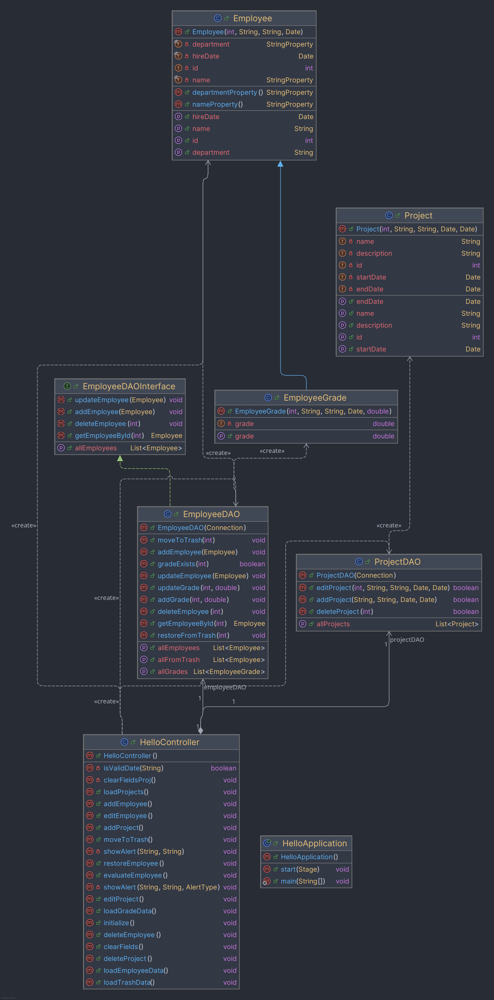
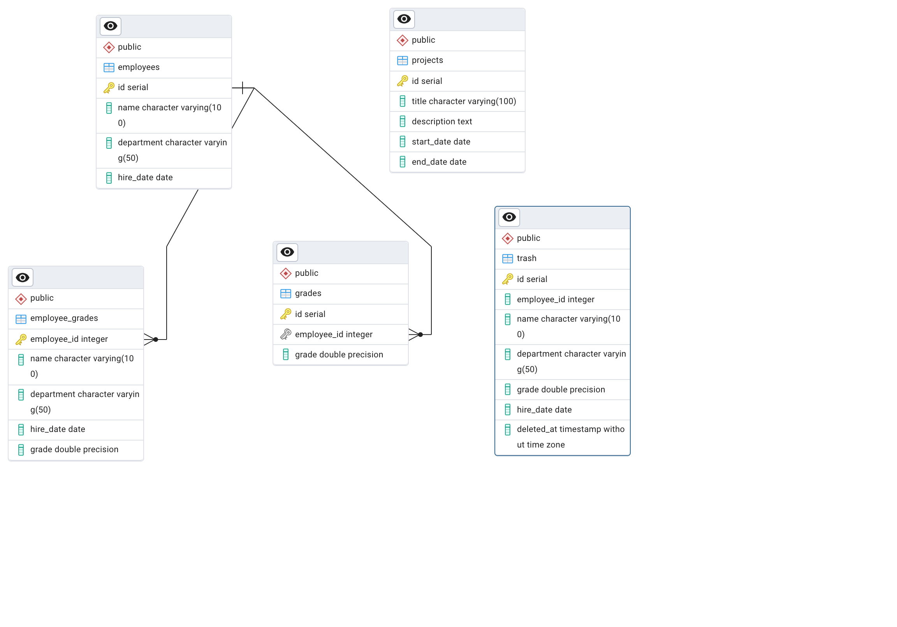

# Employee Performance Management System

## Table of Contents
1. [Description](#description)
2. [Project Requirements List](#project-requirements-list)
3. [Team Members List](#team-members-list)
4. [Roles of Group Members](#roles-of-group-members)
5. [Screenshots](#screenshots)
6. [Sample Data](#sample-data)
7. [UML Class Diagram](#uml-class-diagram)
8. [E-R Diagrams](#e-r-diagrams)
9. [Weekly Meeting Documentation](#weekly-meeting-documentation)
10. [OOP Concepts and questions](#oop-concepts-and-questions)
11. [Unit Test Cases](#unit-test-cases)
12. [Presentation](#presentation)
13. [Github Repository](#github-repository)
14. [Jar File Build](#jar-file-build)
    

## Description
The Employee Performance Evaluation System helps an organization manage and assess its employees' performance efficiently. It allows the user to add, edit, delete, and even move employee records to the trash. An employee's performance is also tracked through an evaluation system based on attendance, soft skills, and hard skills. This will enable the HR team to effectively manage and evaluate the overall performance of the employees. Besides, it has functions for managing and restoring deleted employee records.

## Project Requirements List
The following key functionalities are essential for the completion of the project:
1. **Add Employee**: Add new employees to the system with basic information such as name, department, and hire date.
2. **Edit Employee**: Modify employee details like name and department.
3. **Delete Employee**: Delete an employee’s record and move it to a trash table.
4. **Restore Employee**: Restore a deleted employee’s record from the trash table back to the main employee table.
5. **Evaluate Employee**: Assess employee performance based on attendance, soft skills, and hard skills, then calculate an overall grade.
6. **View All Employees**: Display a list of all employees with relevant details.
7. **View Trash**: View deleted employees’ details in the trash table.
8. **Employee Grades**: View and update performance grades for employees based on evaluations.
9. **Grade Existence Check**: Ensure that grades are only added or updated for existing employees.
10. **Clear Input Fields**: Automatically clear the input fields after adding or editing employee records.
11. **Add Project**: Add new projects to the system with basic information such as name, description, dates.
12. **Delete Project**: Deletes project data without moving it to the trash.
13. **Edit Project**: Changes the project data like name, description, dates.
14. **View All Projects**: Display a list of all projects with relevant details.

## Team Members List
- **Adil Bikiev** - Project Manager, Database Administrator, Backend Developer
- **Yryskeldi Bakhapov** - Tester, UI/UX Designer, Content Creator
- **Altynbek Zhonguchkaev** - Database Administrator, Backend Developer, Frontend Developer

## Roles of Group Members
- **Adil Bikiev**: Managed the overall project, implemented the backend logic, and integrated database functions.
- **Yryskeldi Bakhapov**: Designed the user interface using JavaFX and SceneBuilder. Handled front-end integration.
- **Altynbek Zhonguchkaev**: Managed the database schema, created the `EmployeeDAO` class, and handled database connections and queries.

## Screenshots
Below are key screenshots showcasing the application:
- **Home**: 
- **Employee**:    
- **Edit**:   
- **Grades**:    
- **Trash**:   
- **Database**:     

## Sample Data
It is possible in PostgreSQL: 
```
-- Insert data into the employees table
INSERT INTO employees (name, department, hire_date)
VALUES 
('Alice Johnson', 'HR', '2020-05-15'),
('Bob Smith', 'IT', '2018-03-20'),
('Charlie Brown', 'Finance', '2019-07-10'),
('Diana White', 'IT', '2021-01-25'),
('Eve Black', 'Marketing', '2022-08-05');

-- Insert data into the grades table
INSERT INTO grades (employee_id, grade)
VALUES 
(1, 8.5),
(2, 9.2),
(3, 7.8),
(4, 6.5),
(5, 8.9);

-- Insert data into the projects table
INSERT INTO projects (pr_employee_id, title, description, start_date, end_date)
VALUES
(2, 'Cloud Migration', 'Migrate the company\'s infrastructure to the cloud', '2023-01-01', '2023-06-30'),
(3, 'Budget Analysis', 'Perform a detailed analysis of company expenses', '2023-02-15', NULL),
(5, 'Marketing Campaign', 'Launch a new social media campaign', '2023-03-01', '2023-05-15');

INSERT INTO trash (employee_id, name, department, grade, hire_date)
VALUES 
(999, 'John Doe', 'Research', 7.5, '2021-12-01');
```
This is also possible by simply running our application and filling the table with this data through the application.

## UML Class Diagram
The UML class diagram provides a visual representation of the system’s structure, detailing the classes, attributes, methods, and their relationships.



### Diagram Description:
- **Employee**: Represents employee details with attributes like `name`, `department`, and `hireDate`.
- **EmployeeGrade**: Extends `Employee` and adds an additional property `grade` to store the evaluation score.
- **EmployeeDAO**: Handles database operations for managing employees and grades.
- **EmployeeDAOInterface**: Interface for CRUD operations related to employee records.
- **HelloController**: JavaFX controller that handles UI interactions, including employee addition, modification, deletion, and evaluation.

## E-R Diagrams



## Weekly Meeting Documentation
Weekly meeting summaries and action items can be found in the [Google Docs link](https://docs.google.com/document/d/1E4ld5ssIVgZshUG-lhLDjgzNAuSk3Rkg3Ik92CVwCgI/edit?usp=sharing).

## OOP Concepts and questions

### 1. **Encapsulation**
**Explanation:**  
Encapsulation is used to protect data by making fields private and providing public getter and setter methods to access and modify them.

**Code Example:**
```java
public class Employee {
    private final StringProperty name;
    private final StringProperty department;
    private final Date hireDate;
    private int id;

    public Employee(int id, String name, String department, Date hireDate) {
        this.id = id;
        this.name = new SimpleStringProperty(name);
        this.department = new SimpleStringProperty(department);
        this.hireDate = hireDate;
    }

    // Getter for name
    public String getName() {
        return name.get();
    }

    // Setter for name
    public void setName(String name) {
        this.name.set(name);
    }
}
```

### 2. **Access Modifiers**
**Explanation:**  
Access modifiers control the visibility of classes, methods, and variables. `private` hides the fields from outside, while `public` makes them accessible.

**Code Example:**
```java
public class EmployeeDAO {
    private final Connection connection;  // private access to the connection

    // public method accessible from outside
    public void addEmployee(Employee employee) {
        String query = "INSERT INTO employees (name, department, hire_date) VALUES (?, ?, ?)";
        try (PreparedStatement statement = connection.prepareStatement(query)) {
            statement.setString(1, employee.getName());
            statement.setString(2, employee.getDepartment());
            statement.setDate(3, new java.sql.Date(employee.getHireDate().getTime()));
            statement.executeUpdate();
        } catch (SQLException e) {
            e.printStackTrace();
        }
    }
}
```

### 3. **Constructor**
**Explanation:**  
Constructors are used to initialize objects with a valid state at the time of creation.

**Code Example:**
```java
public Employee(int id, String name, String department, Date hireDate) {
    this.id = id;
    this.name = new SimpleStringProperty(name);
    this.department = new SimpleStringProperty(department);
    this.hireDate = hireDate;
}
```

### 4. **Method Overloading**
**Explanation:**  
Method overloading allows multiple methods with the same name but different parameters, enabling the handling of different input types.

**Code Example:**
```java
public void addGrade(int employeeId, double grade) {
    // Add grade to employee
}

public void addGrade(EmployeeGrade employeeGrade) {
    // Add grade from EmployeeGrade object
}
```

### 5. **Exception Handling**
**Explanation:**  
Exception handling is used to manage errors, ensuring the application does not crash due to unexpected issues.

**Code Example:**
```java
try {
    Connection connection = DriverManager.getConnection("jdbc:postgresql://localhost:5432/postgres", "postgres", "123456");
} catch (SQLException e) {
    e.printStackTrace();
    showAlert("Database Error", "Could not connect to the database.");
}
```

### 6. **Inheritance**
**Explanation:**  
Inheritance allows a class (e.g., `EmployeeGrade`) to reuse properties and methods from a parent class (`Employee`).

**Code Example:**
```java
public class EmployeeGrade extends Employee {
    private double grade;

    public EmployeeGrade(int id, String name, String department, Date hireDate, double grade) {
        super(id, name, department, hireDate);  // Inherited constructor
        this.grade = grade;
    }
}
```

### 7. **Method Overriding**
**Explanation:**  
Method overriding allows subclasses to provide specific implementations of methods defined in a superclass.

**Code Example:**
```java
@Override
public String getName() {
    return super.getName();  // Overriding the getName method
}
```

### 8. **Interface**
**Explanation:**  
Interfaces define common behavior for classes to implement, ensuring consistency across different implementations.

**Code Example:**
```java
public interface EmployeeDAOInterface {
    void addEmployee(Employee employee);
    void updateEmployee(Employee employee);
}

public class EmployeeDAO implements EmployeeDAOInterface {
    @Override
    public void addEmployee(Employee employee) {
        // Implement add logic
    }

    @Override
    public void updateEmployee(Employee employee) {
        // Implement update logic
    }
}
```

### 9. **Polymorphism**
**Explanation:**  
Polymorphism allows the handling of objects of different types in a uniform way, typically through a common interface or superclass.

**Code Example:**
```java
List<Employee> employees = new ArrayList<>();
employees.add(new Employee(1, "John", "HR", new Date()));
employees.add(new EmployeeGrade(2, "Alice", "Engineering", new Date(), 85));

// Polymorphism in action
for (Employee e : employees) {
    System.out.println(e.getName());  // Works for both Employee and EmployeeGrade
}
```

### 10. **Dependency Injection**
**Explanation:**  
Dependency Injection reduces tight coupling by passing dependencies (e.g., `EmployeeDAO`) to a class rather than creating them inside.

**Code Example:**
```java
public class HelloController {
    private EmployeeDAO employeeDAO;

    // Constructor Injection
    public HelloController(EmployeeDAO employeeDAO) {
        this.employeeDAO = employeeDAO;
    }

    public void loadEmployeeData() {
        List<Employee> employees = employeeDAO.getAllEmployees();
        employeeTable.getItems().setAll(employees);
    }
}
```

## Unit Test Casesgit co

The EmployeeTest class includes three tests that validate the functionality of the Employee class:

    testGettersAndSetters: Verifies that the getters and setters for the employee’s attributes (ID, name, department, hire date) work as expected.
    testNameProperty: Tests the property functionality of the employee's name and ensures the name can be correctly updated.
    testDepartmentProperty: Tests the property functionality of the employee's department and ensures the department can be correctly updated.

The tests make use of JUnit 5 for structuring and validating the tests.
Test Cases
testGettersAndSetters

This test ensures that the employee's attributes can be correctly set and retrieved using getters and setters.

    Steps:
        An employee object is created with initial values for ID, name, department, and hire date.
        The getters are tested to ensure they return the correct values.
        The employee’s attributes are then updated using setters, and the getters are used again to confirm the updates.

testNameProperty

This test verifies the functionality of the employee's nameProperty() method and checks that the name can be correctly updated.

    Steps:
        An employee object is created.
        The employee's name is updated using setName().
        The nameProperty() method is used to verify that the property value reflects the change.

testDepartmentProperty

This test verifies the functionality of the employee's departmentProperty() method and checks that the department can be correctly updated.

    Steps:
        An employee object is created.
        The employee's department is updated using setDepartment().
        The departmentProperty() method is used to verify that the property value reflects the change.

Dependencies

    JUnit 5: The tests use the JUnit 5 framework for writing and executing the tests.


## Presentation
The project's presentation, I did with free platform "Canva", you can download presentation in PDF-format: [Canva Presentation](https://www.canva.com/design/DAGYJpr8GLQ/Qbxf5jwPTlJ-F0KIpi8T8Q/view?utm_content=DAGYJpr8GLQ&utm_campaign=designshare&utm_medium=link&utm_source=editor)


## GitHub Repository
The project source code and documentation can be accessed on GitHub at [GitHub Repository Link](https://github.com/EMMMABK/Employee-Performance-Evaluation-System.git).

## Jar File Build
Installation requirements:
1. https://gluonhq.com/products/javafx/ - JavaFX
2. https://www.oracle.com/java/technologies/downloads/?er=221886#jdk23-windows - Java Downloads
3. https://johann.loefflmann.net/en/software/jarfix/index.html - Jarfix

You need to provide the path to the JavaFX file
